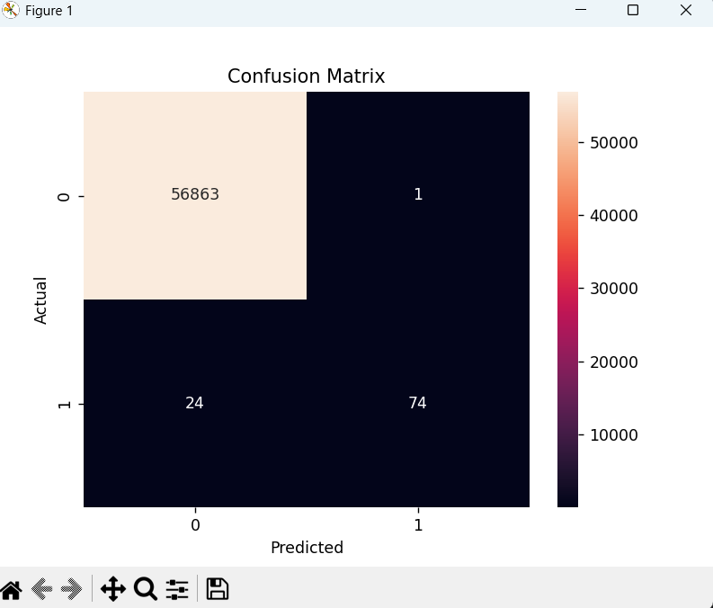
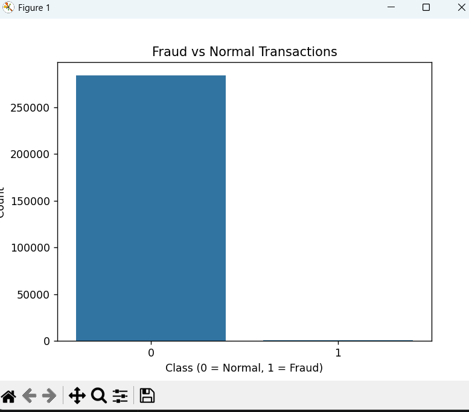

# AI-Based Financial Fraud Detection System

## Author
Fesmi P

## Description
This project implements a machine learning model to detect fraudulent credit card transactions using a real-world imbalanced dataset.

## Features
- Fraud detection using Random Forest
- Handles imbalanced dataset using class weighting
- Performance evaluation using precision, recall, and confusion matrix
- Visualization using heatmaps and class distribution plots

## Tech Stack
- Python
- Pandas
- Scikit-learn
- Matplotlib
- Seaborn

## Dataset
The dataset used is publicly available:
https://www.kaggle.com/datasets/mlg-ulb/creditcardfraud

## Results

### Confusion Matrix

### Class Distribution

## Key Insights
- Achieved high precision (~0.99) in detecting fraudulent transactions
- Maintained strong performance despite class imbalance
- Demonstrated importance of recall in fraud detection systems

## How to Run
1. Install dependencies:
   pip install pandas scikit-learn matplotlib seaborn

2. Download dataset and place it in the project folder

3. Run:
   python fraud_detection.py
